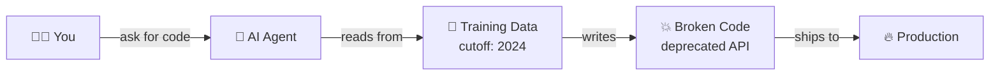
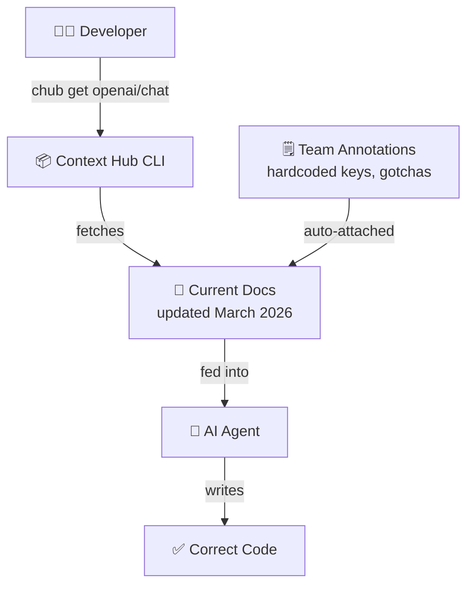
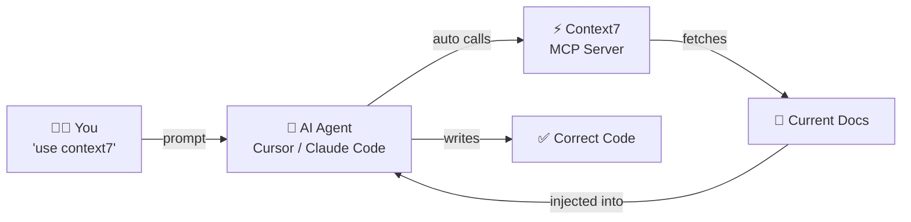
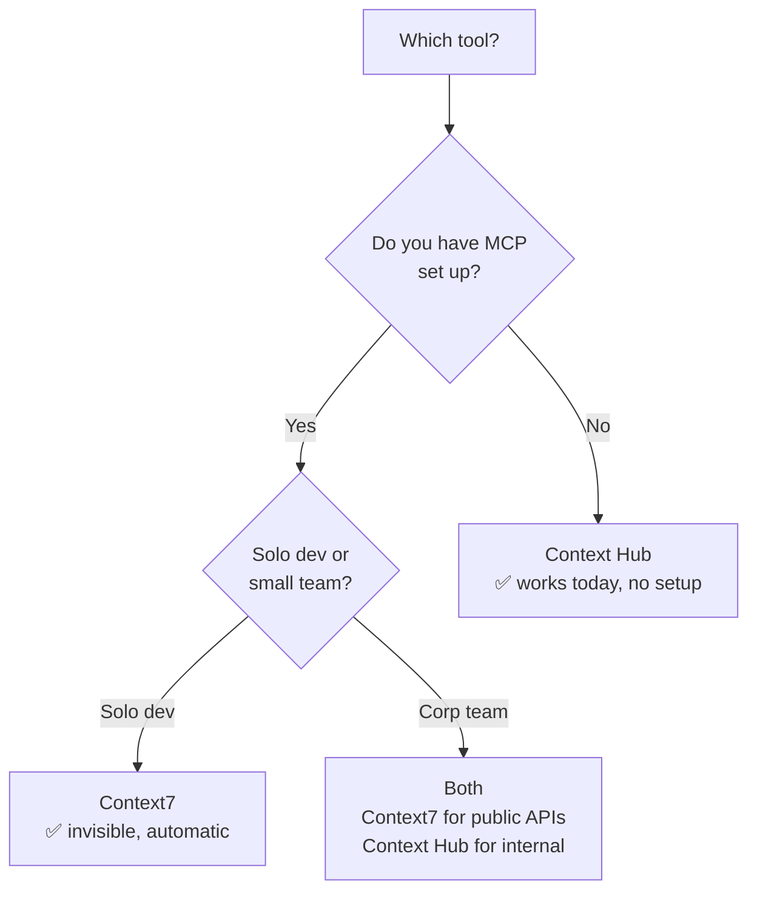

You ask your AI coding assistant to write some code.

It looks great. You ship it. It breaks in production.

Why? Because your AI was working from memory -- and memory goes stale.

---

## The Problem Nobody Talks About

Every AI coding assistant -- Copilot, Cursor, Claude -- was trained on data up to a certain date.

After that date? It knows nothing.



So when you ask it to write code using the OpenAI SDK, it might write this:

```python
# What your AI writes from memory
openai.ChatCompletion.create(model="gpt-3.5-turbo", ...)
```

That method does not exist anymore. Deprecated. Gone.


You just shipped a bug because your AI was reading from an old textbook.

---

## The Fix: Give Your AI Current Docs Before It Writes Code

Both Context Hub and Context7 solve this exact problem -- in different ways.

The idea is simple:

> Before the AI writes code, make it read the actual current documentation first.

That is it. Nothing more complicated.

---

## Context Hub -- The Manual Way




[Context Hub](https://github.com/andrewyng/context-hub) by Andrew Ng is a CLI tool.

You run a command:

```bash
chub get openai/chat --lang py
```

It fetches the current, up-to-date OpenAI docs. Your agent reads them. Writes correct code.

**The interesting bit -- team annotations:**

Say your team got burned once. Someone hardcoded an API key and it leaked. You add a note:

```bash
chub annotate openai/chat "Never hardcode API keys -- always use environment variables"
```

Now every time anyone on the team fetches those docs, that warning shows up automatically. Team knowledge that sticks. Survives session resets. Survives new hires.

**Best for:** Teams without MCP setup. Corp environments. Internal private APIs.

---

## Context7 -- The Automatic Way




[Context7](https://github.com/upstash/context7) by Upstash is an MCP server.

You connect it once to your coding agent. After that -- you just add "use context7" to your prompt.

```
Write me code to call the OpenAI API. use context7
```

That is it. Context7 automatically:
1. Detects you need OpenAI docs
2. Fetches the current version in the background
3. Your agent writes correct, up-to-date code

No commands. No copy-pasting. Completely invisible.

**Best for:** Solo devs. Teams already using MCP. Anyone on Cursor or Claude Code.

---

## Side By Side

| | Context Hub | Context7 |
|---|---|---|
| How it works | CLI -- you fetch manually | MCP server -- fully automatic |
| Setup | `npm install -g @aisuite/chub` | Connect MCP once |
| Team annotations | Yes -- knowledge sticks | No |
| Private/internal APIs | Yes -- host your own docs | No |
| Free tier | Completely free | 1,000 calls/month free |
| Best for | Corp teams, internal APIs | Solo devs, public libraries |

---

## Real Example

Without Context Hub or Context7, an AI agent writes:

```python
# BROKEN -- deprecated since 2023
import openai
openai.api_key = "your-key"
response = openai.ChatCompletion.create(
    model="gpt-3.5-turbo",
    messages=[{"role": "user", "content": "Tell me a joke"}]
)
print(response["choices"][0]["message"]["content"])
```

With Context Hub or Context7, the same agent writes:

```python
# CORRECT -- current as of March 2026
from openai import OpenAI
client = OpenAI()  # picks up OPENAI_API_KEY from environment
response = client.responses.create(
    model="gpt-4o",
    input="Tell me a joke"
)
print(response.output_text)
```

Same task. Completely different result. One breaks. One works.

---

## Which One Should You Use?



**Solo dev using Claude Code or Cursor?** Set up Context7 today. Takes 5 minutes, works forever.

**Working in a corp team without MCP?** Start with Context Hub. No approvals needed, works immediately.

**Both?** Use Context7 for public libraries (OpenAI, Stripe, React) and Context Hub for your internal APIs and team annotations. They are not mutually exclusive.

---

## The Bigger Picture


This is not just about fixing broken imports.

It is about making AI agents reliable. Right now, every AI coding assistant has a built-in expiry date on its knowledge. Context Hub and Context7 are the first practical tools that patch that gap.

As agentic AI becomes standard in engineering teams, tools like these will not be optional. They will be table stakes.

The teams that figure this out now will ship faster and break less.

---

*Built a demo of this? Trying it in your team? I would love to hear how it goes.*
